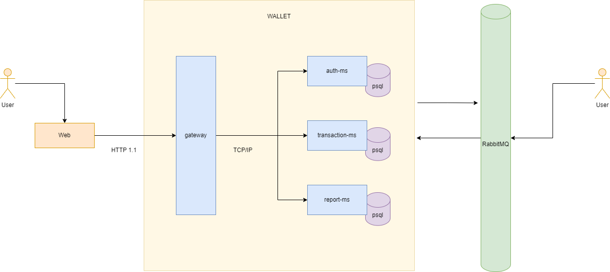
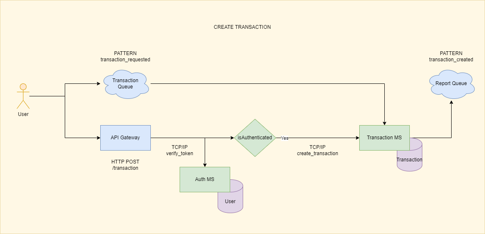
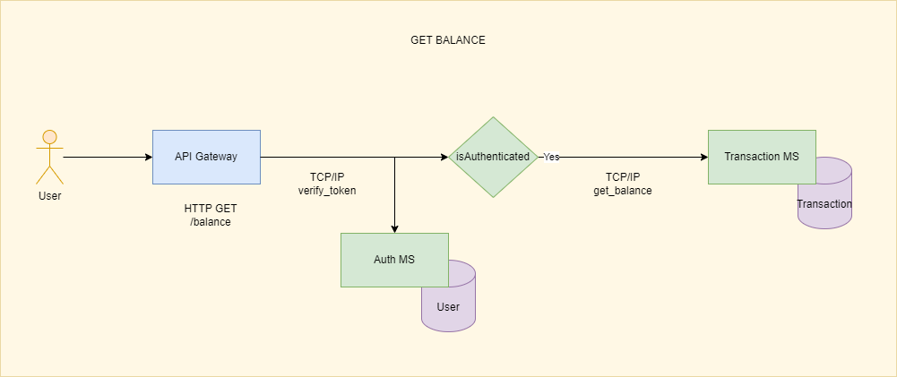
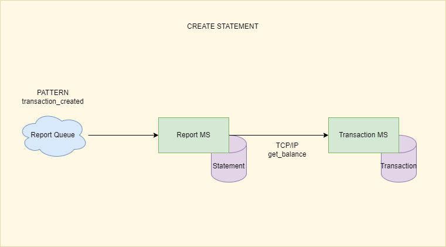

# Digital Wallet

## [:bulb:] About

A simple digital wallet designed to provide users with essential financial functionalities:

* User management and authentication.
* Create transactions operation like: DEPOSIT, WITHDRAW, PURCHASE, REVERSAL, and CANCEL.
* View user balance.
* Generate reports resembling bank statements.

## [:wrench:] Setup

To set up the application you must have **Docker** installed on your machine. For local configuration you must install **NodeJs** with version as described in `.nvmrc` file.

* To set up infrastructure:
  - Go to root folder
  - `cp .env.example .env`
  - `docker compose up -d postgres`
  - `docker compose up -d rabbitmq`

* To set up local:
  - Go to each microservice (gateway, auth-ms, transaction-ms and report-ms) and `cp .env.example .env`
  - Install dependencies: `npm install`
  - Run Prisma commands (except for the gateway): `npx prisma generate && npx prisma migrate deploy`
  - Run application: `npm start`

* To set up with docker:
  - Go to each ms (gateway, auth-ms, transaction-ms and report-ms) and `cp .env.docker.example .env`
  - Go back to root folder
  - Run commands: `docker compose up -d auth_ms && docker compose up -d transaction_ms && docker compose up -d report_ms && docker compose up -d gateway`

## [:pill:] Tests

For testing is used **Jest** as suite to handle both unit and feature tests. To run a test go to a microservice folder and execute `npm test` or `npm run test:cov` to generate coverage details.

## [:scroll:] Documentation

All Rest API documentation can be found at `http://localhost:3000/docs`.

## [:blue_book:] Architecture

The application is built using technologies to ensure robustness and scalability:

* **Backend**: developed using **NodeJs** with **NestJs** as the framework to ensure efficient and scalable server-side applications.
* **Microservices Architecture**: for enhanced modularity and scalability.
* **Database per service**: each microservice has its own database to ensure that the services are loosely coupled.
* **CQRS pattern**: in order to maximize perfomance, the microservices are distributed in one that only receives update operations (transaction-ms) and other (report-ms) that only executes queries in the stored data.
* **Relational Database**: utilizes **PostgreSQL** as a relational database system due to  its high data consistency and integrity, with the powerful **Prisma** library to auto-generate SQL migrations.
* **Message Broker**: communication between microservices is facilitated by queues provided by **RabbitMQ** AMQP broker.
* **API Gateway**: a centralized gateway that handles **HTTP 1.1** requests and utilizes the **TCP/IP** protocol for service calls, providing an external interface through **Swagger** browser documentation `/docs`.

For microservice distribution we have:

1. **Gateway**: responsible for being an external interface to listen for HTTP requests and proxy to each microservice routine.
2. **Auth MS**: responsible for user registration and authentication.
3. **Transaction MS**: responsible for handling transaction operation events and generate user balance.
4. **Report MS**: responsible for handling bank statement reports.

### [:money_with_wings:] Create Transaction Workflow

Example payloads:

* For AMQP: 
`{"pattern":"transaction_requested","data":{"operation":"deposit","amount":2000,"originId":"1deb0188-36ce-43f3-ac71-c2c503c05c35","parentTransactionId":"1deb0188-36ce-43f3-ac71-c2c503c05c35","userId":"6f444465-5b5c-4e0a-a821-05d11ab01065"}}`
* For HTTP: `{"operation":"deposit","amount":2000,"originId":"1deb0188-36ce-43f3-ac71-c2c503c05c35","parentTransactionId":"1deb0188-36ce-43f3-ac71-c2c503c05c35" }`

### [:moneybag:] Get Balance Workflow

### [:clipboard:] Create Statement Workflow

Example payloads:

* For AMQP: 
`{"pattern":"transaction_created","data":{"operation":"deposit","amount":2000,"transactionId":"1deb0188-36ce-43f3-ac71-c2c503c05c35","userId":"6f444465-5b5c-4e0a-a821-05d11ab01065"}}`

### [:bar_chart:] Get Statement Workflow

